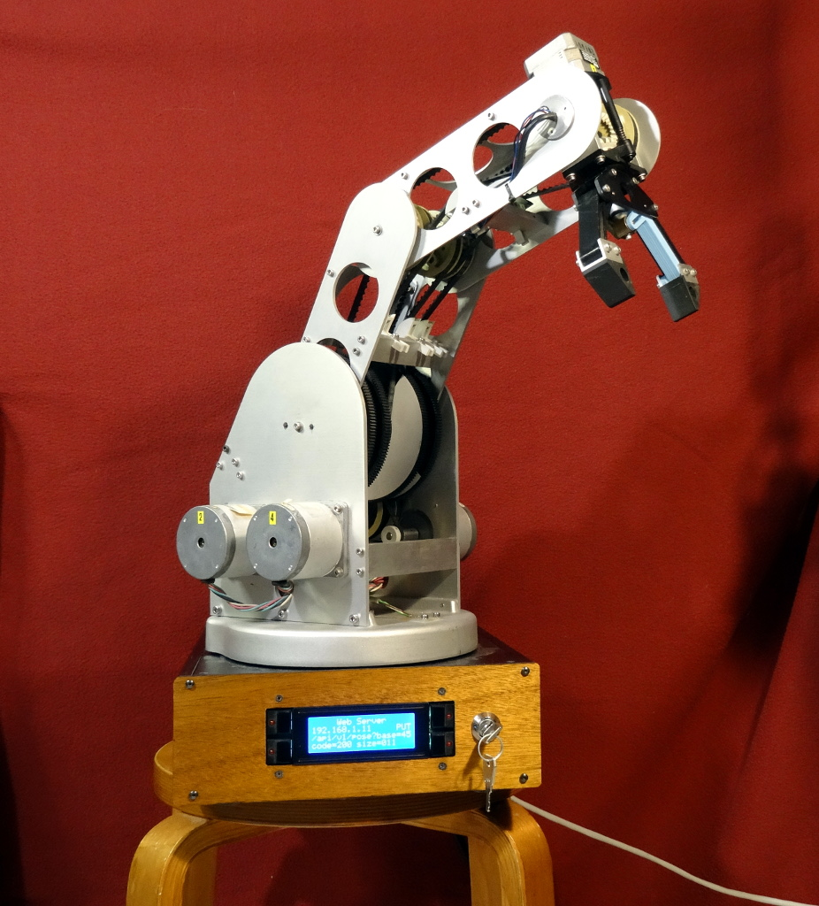

Content
=======

A nROS node for controlling a Youpi robotic arm.

The Genesis
===========

The Youpi robotic arm is an educational tool which has been distributed in France
during the early 80ies for teaching the basics of robotics in technology oriented classes.

It was supposed to be controlled by a personal computer built by the French maker
Thomson, which was one of the providers of the Education National Administration in these old ages.
The communication link between them was achieved by a DB25 interface, exposing the raw signals
for stepping the 6 motors contained in the arm. The control software was a proprietary one,
targeting for this computer only.

For more detail about Youpi : `<http://youpi.forler.ch/>`_ (French)

One copy of this arm has been donated to `POBOT association <http://www.pobot.org>`_ by a teacher,
since it was no more used (nor usable) for years and thus was taking place in his lab for nothing.
He gave it to us as a source of mechanical spare parts in his mind.

However, since we cannot bear destroying something that could possibly still work, we have
first developed an interface connected on the DB25 port for generating the proper signals
based on commands sent on a serial link. This has been done with an Arduino for the hardware
part, and the protocol used by the `Dynamixel servos <http://www.robotis.com/xe/dynamixel_en>`_
for the communication layer.

Complemented with a Raspberry Pi implementing a `Videotex <https://en.wikipedia.org/wiki/Videotex>`_ server,
this has resulted in a 80ies flavoured `demonstrator <http://www.pobot.org/Le-mariage-des-annees-80-et-2010.html>`_
presented during the French national scientific event (`Fête de la Science <http://www.fetedelascience.fr/>`_).

The present
===========

As stated in the introduction description, this package implements a nROS node exposing most of the
commands allowing to control the arm. Thanks to it, any application or extension within the nROS world,
or connected to it can interact with the arm, without having to deal with the inner details of the steppers
control or whatever similar.

The advantage of exposing as a nROS node over a simple library approach, is that it makes possible
to have several application to interact with it at the same time. Of course they need to coordinate
themselves to avoid sending conflicting commands, but since the low level communication is funneled
by the node, there is no problem with a shared access to the hardware level layers (e.g. SPI bus use to
control the stepper drivers). The node plays thus the same role as a driver for any piece of hardware.

Dependencies
============

In addition to `nROS core <https://github.com/pobot-nros/nros-core>`_, this project depends on the
Youpi interfacing library available on `GitHub <https://github.com/pobot-pybot/pybot-raspi>`_ too.